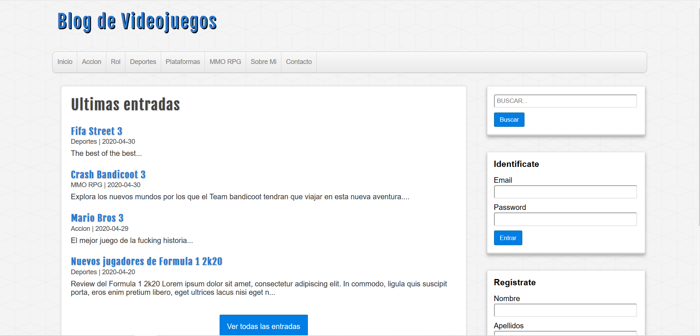

## Project developed with PHP 7.

**Among its functionalities are:**
- MySQL Database Connection.
- Options for registration, logging and storage of credentials in the database.
- Creation of new video game categories and their edition.
- Editing user credentials.
- Creation and edition of video game articles that have a name, category, date and description.
- Database interaction for SQL queries such as SELECTS, INSERTS, UPADTE and DELETE.

**SCREENSHOT**
